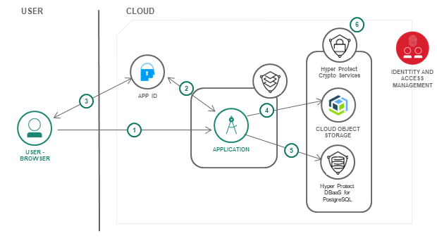
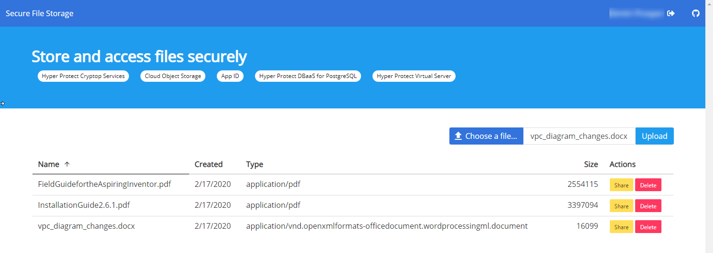
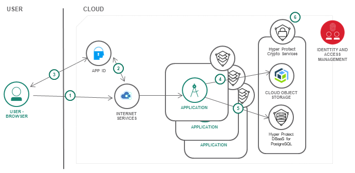

# Secure File Storage 

This repository features a sample application that enables groups of users to upload files to a common storage pool and provide access to those files via shareable links. The application is written in [Node.js®](https://nodejs.org/) and deployed to the [IBM Cloud™](https://cloud.ibm.com/) Hyper Protect Virtual Server service. It leverages several security-related [IBM Cloud services](#services) and features to improve application security. 



The application is a Vue.js application that makes calls to a set of secure routes running in a Node.js application on the Hyper Protect Virtual Server.
1. A user opens the application and triggers a login request in the app which kicks off the authentication process.
2. App ID begins the authentication process by displaying the Login Widget.
3. The user provides a username or email and password, once identity is confirmed is redirected to the application.
4. The application reads/writes to a Cloud Object Storage (COS) bucket.
5. The application reads/writes a table in the Hyper Protect DBaaS for PostgreSQL for metadata information on files stored in the COS bucket.
6. Hyper Protect Crypto Services is responsible for encrypting the data stored in the COS bucket and the PostgreSQL database. Identity and Access Management is used to allow for the Virtual Server to access the encryption key for read/write access to the data.

## Costs

You must have a Pay-as-You-Go account IBM Cloud™ to follow the steps in this repository to create resources. Since the costs for these resources will vary, use the [Pricing Calculator](https://cloud.ibm.com/estimator/review) to generate a cost estimate based on your projected usage.

Some of the services listed above offer a limited free tier, i.e. App ID, Hyper Protect Virtual Server, Hyper Protect DBaaS which you can use for testing and will work perfectly for our example application. Please note the implication of using the free services as some will be deleted automatically after 30 days.

If you deploy paid services, make sure to delete them when they are no longer required in order to not incur charges in your account.

### Prerequisites

Before you create any resources, review the [regions for which the Hyper Protect services are currently available](https://cloud.ibm.com/docs/services/hs-crypto?topic=hs-crypto-regions).

- Follow the steps outlined in the [App ID - Creating a service instance](https://cloud.ibm.com/docs/services/appid?topic=appid-getting-started#create) section of the **Getting started tutorial** to create an App ID instance. You may create a Lite(Free) plan instance if you only intend on testing with the code in this repository. Once the instance is created, you can proceed to the steps described below.

- Follow the steps outlined in the [Getting Started with Hyper Protect Crypto Services](https://cloud.ibm.com/docs/services/hs-crypto?topic=hs-crypto-get-started) topic to create a service instance.  Then initial the instance following the steps outlined in [Initializing service instances](https://cloud.ibm.com/docs/services/hs-crypto?topic=hs-crypto-initialize-hsm).

- Follow the steps outlined in the [Provisioning a Virtual Server](https://cloud.ibm.com/docs/services/hp-virtual-servers?topic=hp-virtual-servers-provision) topic to create a virtual server instance. You may create a Lite(Free) plan instance if you only intend on testing with the code in this repository.

- Follow the steps outlined in the [Provision storage](https://cloud.ibm.com/docs/cloud-object-storage?topic=cloud-object-storage-provision) topic to create a Cloud Object Storage instance and then [grant service access to Hyper Protect Crypto Services](https://cloud.ibm.com/docs/cloud-object-storage?topic=cloud-object-storage-encryption#grant-service-authorization) and then [create a Bucket](https://cloud.ibm.com/docs/cloud-object-storage?topic=cloud-object-storage-encryption#create-a-bucket).

<!-- - Follow the steps outlined in the [Provision an instance of the IBM Cloud Activity Tracker with LogDNA service](https://cloud.ibm.com/docs/services/Activity-Tracker-with-LogDNA?topic=logdnaat-getting-started#gs_step1) topic to create a an instance of Activity Tracker and make sure to [configure platform services logs](https://cloud.ibm.com/docs/services/Log-Analysis-with-LogDNA?topic=LogDNA-config_svc_logs). -->

- Follow the steps outlined in the [Creating a service instance](https://cloud.ibm.com/docs/services/hyper-protect-dbaas-for-postgresql?topic=hyper-protect-dbaas-for-postgresql-dbaas_webui_service#dbaas_webui_create_service) section of the **Gettting started tutorial**  to create an instance of the Hyper Protect DBaaS for PostgreSQL. You may create a Lite(Free) plan instance if you only intend on testing with the code in this repository.  

  > Note: The application in this repository also supports running against an instance of Hyper Protect DBaaS for MongoDB. You will find the configuration and code included, however, the defaults are set for PostgreSQL.


## Grant a service authorization

In order to add Hyper Protect Crypto Services encryption to your data stored in a Cloud Object Storage bucket and PostgreSQL follow these steps to grant access to the services:

1. Go to [Identity & Access > Authorizations](https://cloud.ibm.com/iam/#/authorizations) in the IBM Cloud console.
2. Click the **Create** button.
3. In the **Source service** menu, select **Cloud Object Storage**.
4. In the **Source service instance** menu, select the **All instances** service previously created. (Note: if you want to get more granular and only give access to individual service instances, you should perform these steps after you create the COS instance).
5. In the **Target service** menu, select **Hyper Protect Crypto Services**.
6. In the **Target service instance** menu, select the Hyper Protect Crypto Services instance that you created earlier.
7. Enable the **Reader** role.
8. Click the **Authorize** button.
9. Repeat the above steps, but this time in steps 3 and 4, select **Hyper Protect DBaaS for PostgreSQL**. 

## Getting started

1. Clone this repository to your local computer.
1. From a terminal window change to the `hpvs-secure-file-storage` directory.
1. Copy the **secrets-template** directory to a directory called **secrets**.

## Configure for the application

> The application is initially not configured for HTTPS, this exercise if left to you as you can either configure Node.js with your own SSL certificate, or as described further below, deploy Cloud Internet Services or your own proxy. 

1. In the [Resource List](https://cloud.ibm.com/resources) click on the previously created Hyper Protect Virtual Server instance.
   * Click on the **Manage** tab and capture the **Public IP address** for your instance.

1. In the [Resource List](https://cloud.ibm.com/resources) click on the previously created App ID service.
   * Go to **Manage Authentication**, then **Authentication Settings**.
   * In the **Add web redirect URLs** form add `http://public_ip_address_of_virtual_server/appid_callback` as a URL.
   * Go to **Applications** on the left panel and click on **Add application**.
   * Give a name to the web application, i.e. `hvps-secure-file-storage` and for type select `Regular web application`, click on **Save**.
   * Expand the application in the view and copy the JSON object that is generated.  
   * Create a new file called `appid.json` under the `secrets` directory you created earlier and paste the content captured above.
   
1. In the [Resource List](https://cloud.ibm.com/resources) click on the previously created Cloud Object Storage instance.
   * Under **Service credentials**, click on **New credential**.
   * Set the **name**.
   * Set **Role** to **Writer**.
   * Do not specify a **Service ID**.
   * Set **Inline Configuration Parameters** to **{"HMAC":true}**. This is required to generate pre-signed URLs.
   * Click **Add**.
   * Copy the credentials to your clipboard by clicking **View credentials**.
   * Create a new file called `cos.json` under the `secrets` directory you created earlier and paste the content captured above.

Create the bucket.

2. Click **Create bucket** and then **Custom bucket**.
   * Set the **name** to a unique value, such as **&lt;your-initials&gt;-secure-file-upload**.
   * Set **Resiliency** to **Regional**.
   * Set **Location** to the same location where you created the **secure-file-storage-kp** service.
   * Set **Storage class** to **Standard**
   * Select the checkbox to **Add Hyper Protect Crypto Services key**.
   * Select the Hyper Protect Crypto Services service instance.
   * Select a key name from the drop down.
   * Click **Create bucket**.

1. In the [Resource List](https://cloud.ibm.com/resources) click on the previously created Hyper Protect DBaaS instance.
   * From the overview page, download the CA file and copy it to the `secrets` directory you created earlier, the filename should be cert.pem.
   * Use the information available in the **Overview** and **Users** tabs to fill in the placeholder text in the step further below editing the config.json.

1. Edit config.json:
   * In the `postgresql` properties, replace the placeholder text with the corresponding values for your [Hyper Protect DBaaS PostgreSQL cluster](https://cloud.ibm.com/docs/services/hyper-protect-dbaas-for-postgresql?topic=hyper-protect-dbaas-for-postgresql-dbaas_webui_service#dbaas_webui_manage_service).
   * In the `appid` properties, replace the placeholder text with the url/host address where the app will run, i.e. `http://public_ip_address_of_virtual_server/appid_callback`.


## Deploy the application
        
1. From a terminal window, go up 1 directory level above  the `hpvs-secure-file-storage` directory. Issue the following command to copy the directory to your Hyper Protect Virtual Server instance: 
    ```
    scp -r ./hpvs-secure-file-storage root@placeholder_ip_address:/
    ```

2. SSH to your Hyper Protect Virtual Server instance. 
    ```
    ssh root@public_ip_address_of_virtual_server
    ```

3. Change to the `hpvs-secure-file-storage` directory.
   * Mark all files under the `scritps` directory as executable: ```chmod +x scripts/*.sh```.
   * From the `hpvs-secure-file-storage` directory execute the following script: ```scripts/app-deploy.sh```, if any errors are generated look for a log file named `hpvs-secure-file-storage.<datetime>.log` and review its content and address any of the errors. 

4. Verify the app is online by running the following command `pm2 status`, and confirm that there are no errors by running `pm2 logs` or reviewing the logs directory that is created for you once the app starts.

5. Access the application using your browser and the url of: `http://public_ip_address_of_virtual_server/`

## Application Overview and Code Structure



1. The user connects to the application via the public IP address of the Hyper Protect Virtual Server. 
    > For a production deployment, you will want to add a TLS/Load Balancer service. Consider deploying the [Cloud Internet Service](https://cloud.ibm.com/catalog/services/internet-services). You can use our [Secure web application across multiple regions](https://cloud.ibm.com/docs/tutorials?topic=solution-tutorials-multi-region-webapp#multi-region-webapp) tutorial as a guide to create and configure the service.
2. [App ID](https://cloud.ibm.com/catalog/services/AppID) secures the application and redirects the user to the authentication page. Users can sign up from there too.
3. The application is running in a [Hyper Protect Virtual Server](https://cloud.ibm.com/catalog/services/hyper-protect-virtual-server).
4. Files uploaded by the user are stored in [Cloud Object Storage](https://cloud.ibm.com/catalog/services/cloud-object-storage).
<!-- 5. All activities related to cloud services used are logged by [Cloud Activity Tracker with LogDNA](https://cloud.ibm.com/catalog/services/logdnaat). -->
5. Some activities related to the Node.JS application are logged in a logs directory on the server, i.e. access.log for all routes of the application that are used, system and error logs are also captured. 
    <!-- > You can bring these logs into a central service for analysis and filtering.  Deploy the [Log Analysis with LogDNA](https://cloud.ibm.com/observe/logging/create) and configure the agent for log capture. You can use our [Analyze logs and monitor application health with LogDNA and Sysdig](https://cloud.ibm.com/docs/tutorials?topic=solution-tutorials-application-log-analysis#generate-and-access-application-logs) tutorial for an example on how to configure the service. -->


| File | Description |
| ---- | ----------- |
|[app.js](app.js)|Implementation of the application.|
|[routes/appid.js](routes/appid.js)|Implementation of the App ID authentication routines.|
|[routes/files.js](routes/files.js)|Implementation of the application routes for CRUD operations on files.|
|[utils/](utils/)|Implementation of winston module for application access, system and error logging.|
|[database/](database/)|Contains the database specific code (PostgreSQL and MongoDB) used by the application to retrieve and store in the respective databases.|
|[public/](public/)|Contains a small Vue.js application that interacts with the Node.js backend application.|
|[secrets-template](secrets-template)|To be copied to `secrets` and is to contains configuration files for database, cloud object storage, etc... `config.json` is used to contain the location of the PostgreSQL, App ID, Cloud Object Storage services.|
|[scripts/app-deploy.sh](scripts/app-deploy.sh)|Is a shell script used to install the dependencies of the application on the Virtual Server and configure the Node.js application to run as a service.|


## Services

IBM Cloud services featured: 

  - [App ID](https://cloud.ibm.com/catalog/services/AppID): App ID helps developers to easily add authentication to their web and mobile apps with few lines of code, and secure their Cloud-native applications. By requiring users to sign in to your app, you can store user data such as app preferences, or information from public social profiles, and then leverage that data to customize each user's experience within the app. 

  <!-- - [Cloud Activity Tracker with LogDNA](https://cloud.ibm.com/catalog/services/logdnaat): Activity Tracker records user-initiated activities that change the state of a service in IBM Cloud. You can use this service to investigate abnormal activity and critical actions and to comply with regulatory audit requirements. -->

  - [Cloud Object Storage](https://cloud.ibm.com/docs/cloud-object-storage?topic=cloud-object-storage-about-cloud-object-storage): IBM Cloud™ Object Storage makes it possible to store practically limitless amounts of data, simply and cost effectively. Information stored with IBM® Cloud Object Storage is encrypted and dispersed across multiple geographic locations, and accessed over popular protocols like HTTP using a modern RESTful API. With this service you can use root keys that you manage in Hyper Protect Crypto Services to protect the data encryption keys that encrypt your data at rest.

  - [Hyper Protect Crypto Services](https://cloud.ibm.com/docs/services/hs-crypto?topic=hs-crypto-overview): IBM Cloud™ Hyper Protect Crypto Services offers advanced cloud key management service and Hardware Security Module (HSM) encryption capability with technology that has attained industry's highest security level to protect your data. Hyper Protect Crypto Services is a dedicated HSM that is controlled by you. IBM Cloud™ administrators have no access. The service is built on FIPS 140-2 Level 4-certified hardware.

  - [Hyper Protect DBaaS](https://cloud.ibm.com/docs/services/hyper-protect-dbaas-for-postgresql?topic=hyper-protect-dbaas-for-postgresql-overview): IBM Cloud™ Hyper Protect DBaaS offers highly secure database environments for enterprise workloads with sensitive data. Built on IBM LinuxONE technology, IBM Cloud™ Hyper Protect DBaaS provides built-in encryption and tamper protection for data at rest and in flight. Two flavors of this service are currently available, PostgreSQL and MongoDB.

  - [Hyper Protect Virtual Server](https://cloud.ibm.com/docs/services/hp-virtual-servers?topic=hp-virtual-servers-overview): Hyper Protect Virtual Server is an IBM Cloud™ service that provides highly secure virtual servers that can run Linux applications. It offers a flexible and scalable framework that you can use to quickly and easily provision and manage the created virtual servers.

  - [Cloud Internet Service](https://cloud.ibm.com/catalog/services/internet-services)(optional): Cloud Internet Services (CIS) provides reliability, performance, and security for Internet facing applications, websites, and services using Cloudflare's 165+ Global Points of Presence (PoPs). It includes Domain Name Service (DNS), Global Load Balancer (GLB), Distributed Denial of Service (DDoS) protection, Web Application Firewall (WAF), Transport Layer Security (TLS), Rate Limiting, Smart Routing, and Caching. If deploying the application across multiple availability zones, you can add CIS to load balance the traffic.

    The following deployment example includes CIS in front of 1 or more HP-VS instance acting as a GLB.

      


  <!-- - [IBM Log Analysis with LogDNA](https://cloud.ibm.com/observe/logging)(optional): IBM Log Analysis with LogDNA offers administrators, DevOps teams, and developers advanced features to filter, search, and tail log data, define alerts, and design custom views to monitor application and system logs. -->

## Related Content

Tutorial: [How to apply end-to-end security to a cloud application](https://cloud.ibm.com/docs/tutorials?topic=solution-tutorials-cloud-e2e-security). 

## License

See [License.txt](License.txt) for license information.
